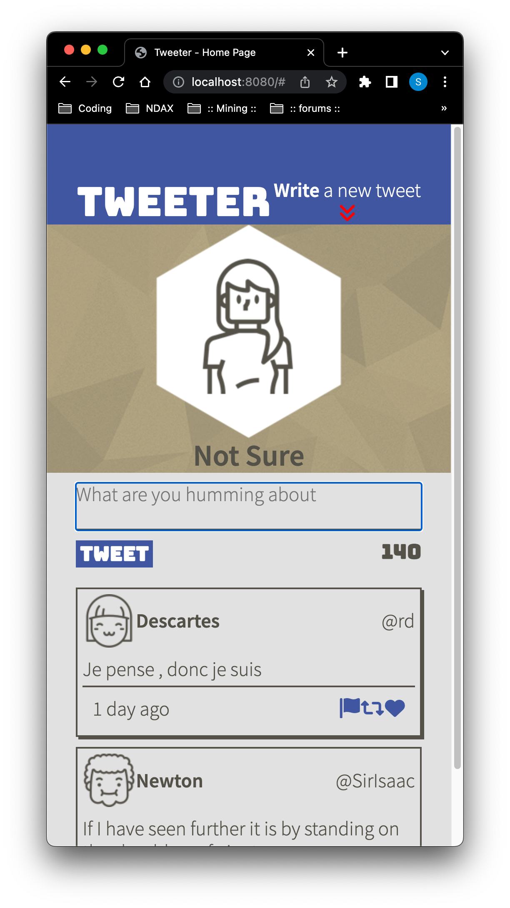
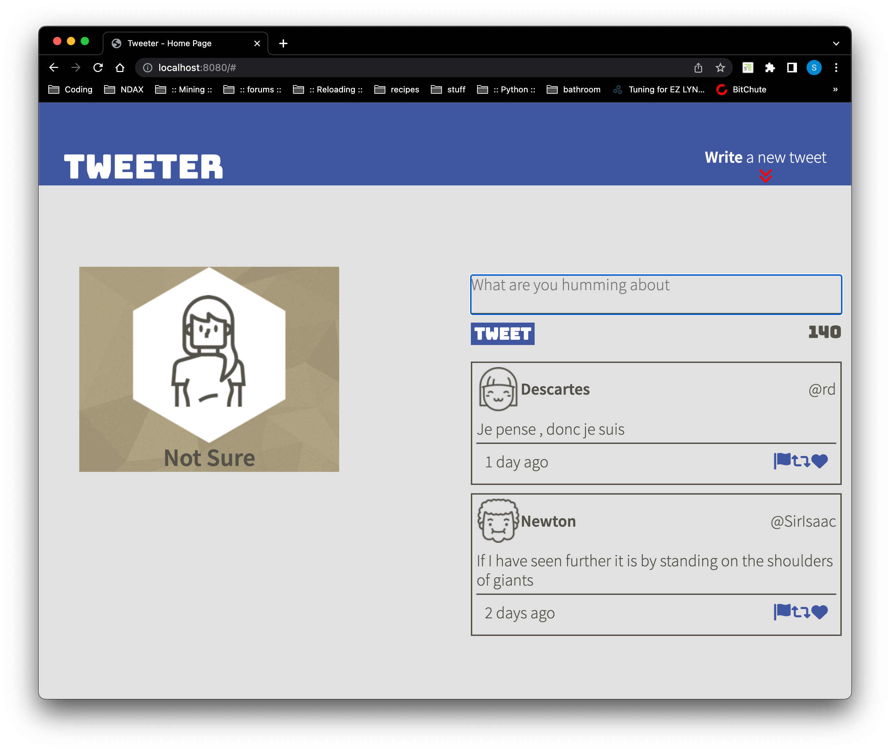

# Tweeter Project

Tweeter is a simple, single-page Twitter clone.

This is an educational project.  This specific project contributed tremendously to learning and understanding concepts in html and css that previously eluded me.

## Dependancies

* node v12
* body-parser
* chance
* express
* md5
* timeago.js
* devDependencies
* nodemon

## Installation

Fork the [repository](https://github.com/navycuda/tweeter) and clone it.

```bash
$ git clone git@github.com:<yourUserName>/tweeter.git
$ cd tweeter
$ npm install
```

## Usage

```bash
$ npm start
```
* `Starts a server instance with the nodemon.`

With webbrowser, navigate to [localhost](http://localhost:8080).

|  |
|:--:|
| `Mobile` The mobile friendly version of this app |

|  |
|:--:|
| `Desktop` The desktop version of this app |